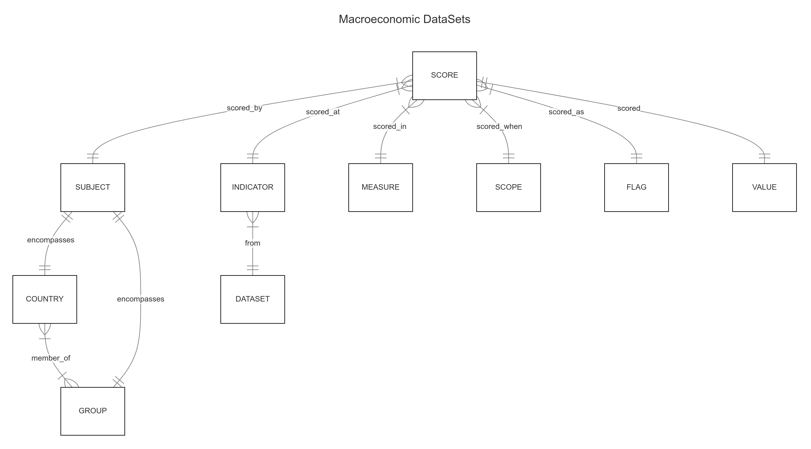

# Design Document

By CANDEA ALEXANDRU-OVIDIU

## Scope

* What is the purpose of the database?\
    To store macroeconomic timeseries data, either user defined or fetched from official sources like: OECD, IMF, Federal Reserve,
    World Bank, Eurostat, etc. The structure and design of the database is capable of accommodating various datasets in a compact and quickly accessible manner.
* Which people, places, things, etc. are included in the scope of the database?\
    Macroeconomic datasets(timeseries) are included in the scope of the database.\
    For the moment the database is hosting **Balance of Payments and National Accounts data**, namely the Organisation for Economic Co-operation and Development(OECD) 2023 archived <ins>"Balance of payments BPM6"</ins> table from Main Economic Indicators statistics(MEI), and 2 tables from System of National Accounts(SNA 2008) statistics: <ins>"Aggregate National Accounts, SNA 2008: Gross domestic product (Edition 2023)"</ins>, and <ins>"General Government Accounts, SNA 2008: Main aggregates (Edition 2023)"</ins>.
* Which people, places, things, etc. are *outside* the scope of the database?\
    The other tables from OECD, SNA 2008 statistics are not included in this demo, but could easily be incorporated, since they describe the same entities (some tables like "General Government Accounts, SNA 2008: Government expenditure by function (Edition 2023)" further partition the data on additional attributes like function and sector, but we can add these to our "indicators" table and assign NULL to the datasets where the fragmentation does not occur), follow the same structure, and are built based on the same logic.

## Functional Requirements

* What should a user be able to do with the database?\
    Statistical data once stored, can be queried for analysis and further manipulation. Also easily scalable.
* What's beyond the scope of what a user should be able to do with the database?\
    No sensible information in the database, not an absurd amount of data, no need for a server connection, works well locally, this is why the SQLite DMS was chosen for the project. For serious statistical analysis the researcher should query the database using the sqlite python extension, the library of SQLite is very poor. One of the queries run for this demo is calculating variances, and it gets complicated really fast.

## Representation

### Entities

* Which entities will be represented in the database and what attributes will those entities have (besides IDs/PKs)?
    - subjects (class comprising names of countries and groups, each member an economic entity in itself)
    - countries (name, currency)
    - groups of countries (names, common currency if the case)
    - memberships of countries in various groups
    - indicators (indicating results in performances, like GDP growth, or in accounting entries, like BoP balances for example; each indicator has an associated name and code)
    - datasets (name, standards compliancy, publication year, publisher, and link)
    - scopes (timeframes of the results, like frequency, year, quarter, month and reference period)
    - measures [the evaluation used to estimate values/scores, for ex. current prices, constant prices, PPPs, current/constant exchange rates, national currency, index, growth rate, deflator etc.; a measure is characterised by name, code, unit (currencies like USD, EUR, LEU, or percentages, points, etc.), power raiser]
    - flags (permanent, provisional, estimation, and other status names for the records)
    - scores [the actual values scored (by each subject, in each category, in each time period, by different measures and in different units, etc.) bring together all other pieces of information into a single registry]

### Relationships

## Optimizations

* Which optimizations (e.g., indexes, views) were created? Why?\
    Because the 'scores' "master-table" reconstructs the (from csv imported) data records in a more compact way, after having dismembered them and stored bits and pieces in "sub-tables", these same records(values along identifiers) are stored in a central registry through the use of foreign keys pointing to all other tables, avoiding duplication of lengthy titles, codes and such.
    In this demo, where we added data from only 3 csv files in our database, we reduced the total disk storage needed from 61.73MB + 267.66MB + 126.79MB = 456.18MB to just 68.02MB!
    And since the data is relational and partitioned, the search performance is much better also!
    No index is needed, the only table that requires scanning is "scores", as it pools al records together, but that is fine, we do not want to search for any particular record by value(not unique) or id(no predefined order).

## Limitations

* What are the limitations of the design?\
    Not being an expert on national accounting or fully familiarised with the hierarchical structure of the accounts, I did not document the child-parent relationships for the indicators representing accounting entries, the same way I did for the membership of countries to groups. This is effort-wise a titanic work to do, but could enhance the logic of the way data is structured and improve searches if taken into account.
* What might the database not be able to represent very well?\
    Because of the sheer complexity and amount of statistical data (the OECD SNA:2008 comprises a total of 61 tables!), not all logic was explored and new attributes might have to be added in order to accommodate all the input csv-s.

## Instuctions

***Run this command from within the project directory: "bash runme.sh | tee output.txt"***

